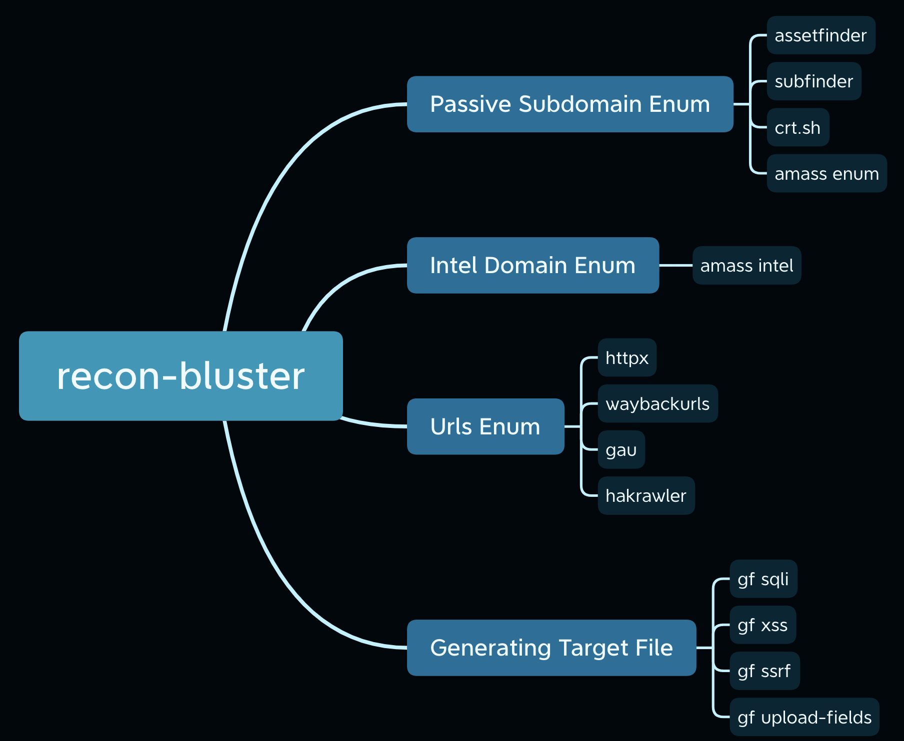

# Summary
recon-bluster is a automated recon tools based on target domain. Combining a set of the best recon tools to enumeration endpoint and generate a target endpoint for further vulnerability scanning. Capable to perform multi-threading for concurrent target recon.
# Recon Workflow

# Installation
```shell
git clone https://github.com/superzerosec/recon-bluster.git
cd recon-bluster
bash install.sh
```
# Usage
```shell
usage: recon-bluster.py [-h] [-d DOMAIN] [-l LIST] [-t THREAD] [-i]

optional arguments:
  -h, --help            show this help message and exit
  -d DOMAIN, --domain DOMAIN
                        Target domain
  -l LIST, --list LIST  List of target domain saperated with new line
  -t THREAD, --thread THREAD
                        Number of thread, default 5
  -i, --intel           Amass intel recon, default False
```

Recon single target on `tesla.com`
```shell
python3 recon-bluster.py -d tesla.com
```
For multiple target in file, create a `list.txt`
```shell
bugcrowd.com
tesla.com
uber.com
```
Recon multiple target on `list.txt`
```shell
python3 recon-bluster.py -l list.txt
```
# Tools Chaining
## SQLMAP
```shell
TARGET=tesla.com; python3 recon-bluster.py -d $TARGET; sqlmap -m $TARGET/target_sqli.txt --random-agent --batch
```
## NUCLEI
```shell
TARGET=tesla.com; python3 recon-bluster.py -d $TARGET; nuclei -silent -l $TARGET/subdomains_httpx.txt -jsonl -o $TARGET/subdomains_nuclei_vulnerabilities_$(date +%Y-%m-%d_%H:%M:%S).json -H "User-Agent: Mozilla/5.0 (Windows NT 10.0; Win64; x64) AppleWebKit/537.36 (KHTML, like Gecko) Chrome/115.0.0.0 Safari/537.36" --severity low,medium,high,critical
```
## AIRIXSS
```shell
TARGET=tesla.com; python3 recon-bluster.py -d $TARGET; cat $TARGET/target_xss.txt | qsreplace '">' | airixss -payload '' | grep "31mVulnerable" | anew target_xss_airixss.txt
```
## SMAP
```shell
TARGET=tesla.com; python3 recon-bluster.py -d $TARGET; smap -iL $TARGET/subdomains.txt -oG $TARGET/subdomains_smap.txt
```
## WAYMORE
```shell
TARGET=tesla.com; python3 ~/tools/waymore/waymore.py -mode U -i $TARGET; cat ~/tools/waymore/results/$TARGET/waymore.txt | anew $TARGET/subdomains_urls_waymore.txt > $TARGET/subdomains_urls_waymore_new.txt
```
# Credit
* [waybackurls](https://github.com/tomnomnom/waybackurls)
* [assetfinder](https://github.com/tomnomnom/assetfinder)
* [anew](https://github.com/tomnomnom/anew)
* [gf](https://github.com/tomnomnom/gf)
* [qsreplace](https://github.com/tomnomnom/qsreplace)
* [dnsx](https://github.com/projectdiscovery/dnsx)
* [httpx](https://github.com/projectdiscovery/httpx)
* [subfinder](https://github.com/projectdiscovery/subfinder)
* [OWASP Amass](https://github.com/OWASP/Amass)
* [gau](https://github.com/lc/gau)
* [hakrawler](https://github.com/hakluke/hakrawler)
* [unew](https://github.com/dwisiswant0/unew)
* [sqlmap](https://github.com/sqlmapproject/sqlmap)
* [nuclei](https://github.com/projectdiscovery/nuclei)
* [airixss](https://github.com/ferreiraklet/airixss)
* [smap](https://github.com/s0md3v/Smap)
* [uncover](https://github.com/projectdiscovery/uncover)
* [tlsx](https://github.com/projectdiscovery/tlsx)
* [katana](https://github.com/projectdiscovery/katana)
* [waymore](https://github.com/xnl-h4ck3r/waymore)
# Special Thanks
* [KingOfBugBountyTips](https://github.com/KingOfBugbounty/KingOfBugBountyTips)
