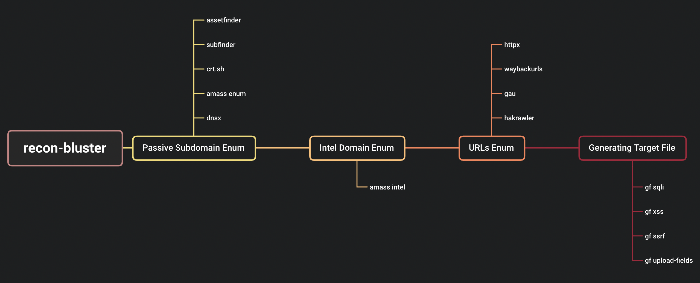

# Summary
recon-bluster is a automated recon tools based on target domain. Combining a set of the best recon tools to enumeration endpoint and generate a target endpoint for further vulnerability scanning.
# Recon Workflow

# Installation
```shell
git clone https://github.com/superzerosec/recon-bluster.git
cd recon-bluster
bash install.sh
```
# Usage
```shell
usage: recon-bluster.py [-h] [-d DOMAIN] [-l LIST]

optional arguments:
  -h, --help            show this help message and exit
  -d DOMAIN, --domain DOMAIN
                        Target domain
  -l LIST, --list LIST  List of target domain saperated with new line
```

Recon single target on `tesla.com`
```shell
python3 recon-bluster.py -d tesla.com
```
For multiple target in file, create a `list.txt`
```shell
bugcrowd.com
tesla.com
uber.com
```
Recon multiple target on `list.txt`
```shell
python3 recon-bluster.py -l list.txt
```
# Tools Chaining
## SQLMAP
```shell
TARGET=tesla.com; python3 recon-bluster.py -d $TARGET; sqlmap -m $TARGET/target_sqli.txt --random-agent --batch
```
## NUCLEI
```shell
TARGET=tesla.com; python3 recon-bluster.py -d $TARGET; nuclei -silent -l $TARGET/subdomains_urls_httpx.txt -json -o $TARGET/subdomains_nuclei_vulnerabilities_$(date +%Y-%m-%d_%H:%M:%S).txt -H '"Mozilla/5.0 (X11; U; Linux i686; en-US; rv:1.8.1.4) Gecko/20061201 Firefox/2.0.0.4"' --severity low,medium,high,critical
```
## AIRIXSS
```shell
TARGET=tesla.com; cat $TARGET/target_xss.txt | qsreplace '">' | airixss -payload '' | grep "31mVulnerable" | anew $TARGET/target_xss_airixss_$(date +%Y-%m-%d_%H:%M:%S).txt
```
# Credit
* [assetfinder](https://github.com/tomnomnom/assetfinder)
* [subfinder](https://github.com/projectdiscovery/subfinder)
* [OWASP Amass](https://github.com/OWASP/Amass)
* [httpx](https://github.com/projectdiscovery/httpx)
* [waybackurls](https://github.com/tomnomnom/waybackurls)
* [gf](https://github.com/tomnomnom/gf)
* [anew](https://github.com/tomnomnom/anew)
* [gau](https://github.com/lc/gau)
* [hakrawler](https://github.com/hakluke/hakrawler)
* [unew](https://github.com/dwisiswant0/unew)
* [qsreplace](https://github.com/tomnomnom/qsreplace)
# Special Thanks
* [KingOfBugBountyTips](https://github.com/KingOfBugbounty/KingOfBugBountyTips)
